# Matrix factorization with PySpark

# Install Apache Spark, Dependent Tools and Environment Path on Windows (Local Machine)
1. Add system variables for Java_Home, Spark, Hadoop
2. Add system variables path for Spark, Hadoop
3. Add user variables for Java_Home, Spark, Hadoop to use the `Apache Spark` from other directory.

- ref video links: https://www.youtube.com/watch?v=0F4fokX5MPQ
- ref video links: https://www.youtube.com/watch?v=QYTPpqPYaw0

😊 Java Download: https://www.java.com/en/download/manual.jsp
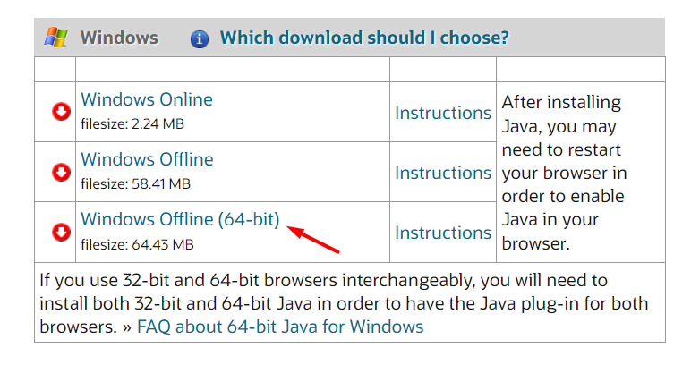
- install Java
- Java Environment:
`Start Menu Search >> Edit The System Variables >> Environment Variables`
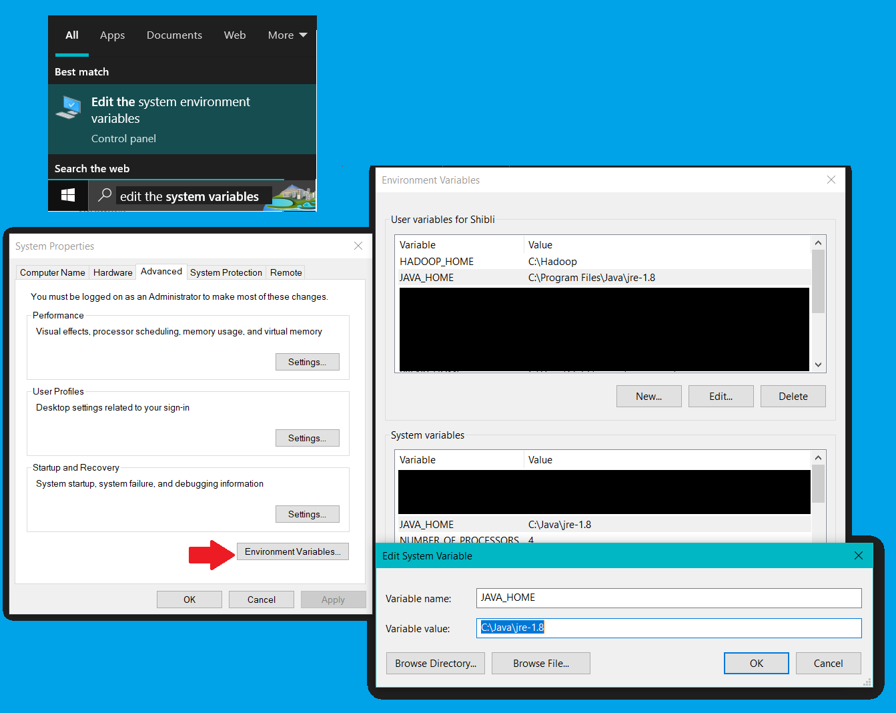

😊 Apache Spark Download: https://spark.apache.org/downloads.html
- Create a folder named `Spark`in C-drive and `unzip' the downloaded version.
- Apache Spark Environment:
`Start Menu Search >> Edit The System Variables >> Environment Variables`
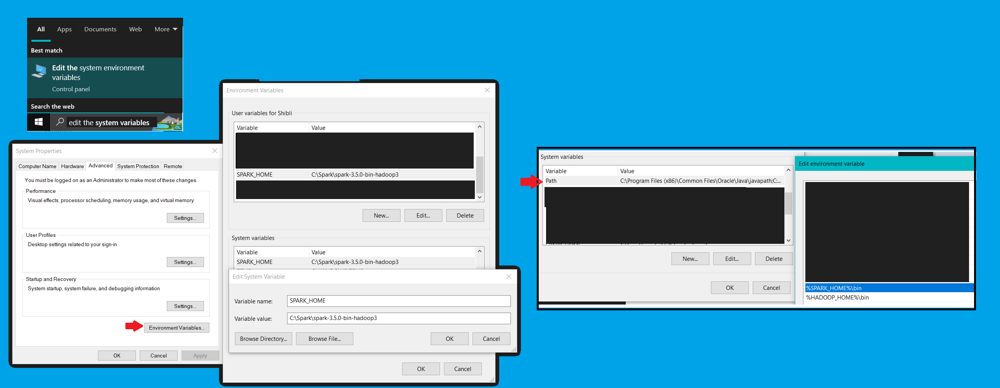

😊 For Hadoop(winutils.exe and hadoop.dll):
- winutils.exe download(as per version of Hadoop while downloading Apache Spark, here Hadoop 3.3): https://github.com/steveloughran/winutils/blob/master/hadoop-3.0.0/bin/winutils.exe
- hadoop.dll(as per version of Hadoop while downloading Apache Spark, here Hadoop 3.3):https://github.com/kontext-tech/winutils/blob/master/hadoop-3.3.0/bin/hadoop.dll
- Create a folder named `Hadoop`in C-drive, then subfolder `bin` and `store' the downloaded file winutils.exe and hadoop.dll under bin folder.
- Hadoop Environment:
`Start Menu Search >> Edit The System Variables >> Environment Variables`
  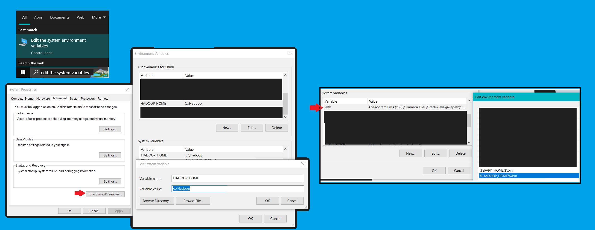

### 😆 Build Spark in powershell of vscode
```sh
spark-shell
```
`sc details: Spark context available as 'sc' (master = local[*], app id = local-1708364284935).`

**note:** bydefault, it starts with scala
### 😆 Submit Spark To check version

```sh
spark-submit --version
```

# PySpark setup 
video link: https://www.youtube.com/watch?v=e17s4ul4uTo
https://www.youtube.com/watch?v=Irn7a8U-QxA
### Check Python Version
start >> cmd >> Run as Administrator
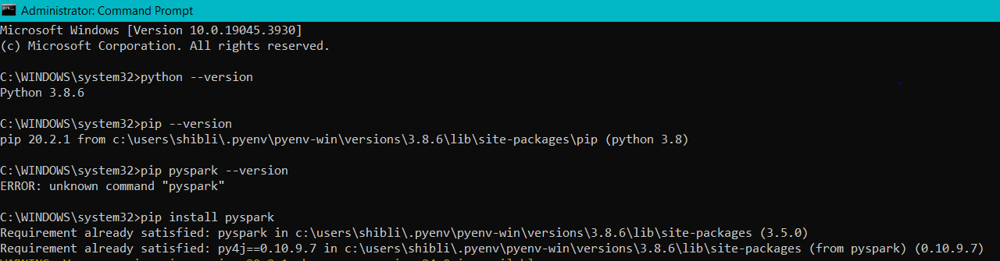


### Failed to Access wsl terminal(Ubuntu) due to forget password

**😟note:** Forget Password Problem:
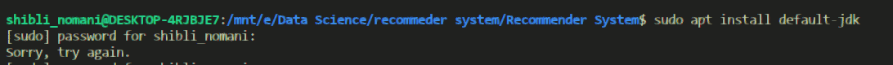
Solution Video Link: https://www.youtube.com/watch?v=RCW9PTNS440
1. Go to command prompt as follows:
   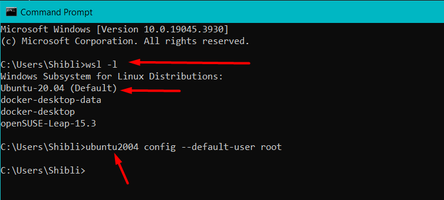
    
    ```sh 
        wsl -l  
    ```
    
    ```sh
        ubuntu2004 config --default-user root
    ```
2. Go to Ubuntu Terminal
   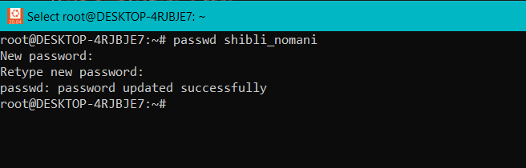
   
   ```
    passwd shibli_nomani
   ```
3. go back to the command prompt and change the default setting (root to shibli_nomani)
   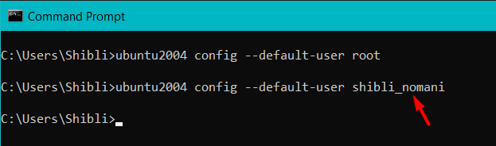
    
    ```
        ubuntu2004 config --default-user shibli_nomani
    ```

##### 😉 Java Install on top of ubuntu

```sh
    java -version
```

```sh
    sudo apt update
```

```sh
    sudo apt install default-jdk
```

##### 😉 Scala Install
scala version
```sh
scala -version
```
```sh
sudo apt install scala
```

##### 😉 Pyspark in powershell(venv in vscode)

```
pip install pyspark
```

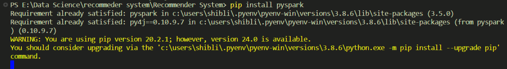


**😤Error :** py4exception occurs due to version mismatch of **Apache Spark and Pyspark**
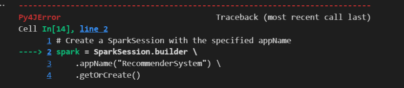

- option-1: **😤 note:** due to old version Apache Spark, you may face unwanted py4JError
solution-1: choose proper version.
ref video link: https://www.youtube.com/watch?v=s2yjvQPGsyw

- option-2: **😤 note:** due to wrong env path setup in windows(startmenu >> search >> edit system evironment variable >> Environment Variable >> `user variable for user_name` & `system variable`)
solution-2: set the path in correct manner.

- option-3: **😤 note:** due to version mismatch of Apache Spark & Pyspark.
solution-3: https://stackoverflow.com/questions/72873963/py4jexception-constructor-org-apache-spark-sql-sparksessionclass-org-apache-s
- check spark version in powershell
```sh
    spark-submit --version
```
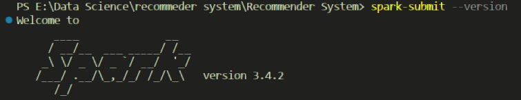

- edit the requirements.txt file with same version of pyspark as per Spark
`pyspark==3.4.2`

- run again the requirements.txt in powershell
  
  **list of libaries**
  - matplotlib
  - matplotlib-inline
  - numpy
  - keras 
  - tensorflow
  - tensorflow-intel
  - scikit-learn
  - seaborn
  - scipy
  - pyspark==3.4.2
  
```sh
    pip install -r requirements.txt
```

### Playing with Pyspark
Becareful about the filepath and choose the absolute filepath to avoid **`Py4JJavaError`** raises due to  filepath issue.
**😤 solution:**
##### Load data using SparkContext
`data = sc.textFile("E:/Data Science/recommeder system/Recommender System/data/smallrating.csv")`

**😤😤😤😤😤solution:**
##### Mismatch in Python in worker and Python Driver
Check Spark URL for Python in worker has different version 3.10 than that in driver 3.8 and **`install correct version for driver according to Python worker. here, 3.10`** 😆😆

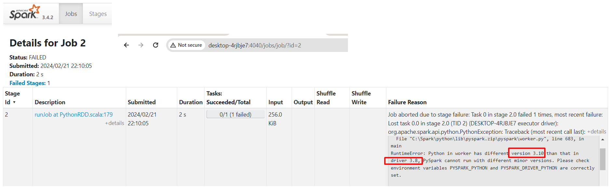

- for python version installation: 

```sh
https://github.com/Shibli-Nomani/MLOps-Project-AirTicketPricePrediction
```
- set pyenv in powershell of vscode before create any venv
```sh
pyenv shell 3.10.8
```
### PySpark 🐍
PySpark is the Python API for Apache Spark, a fast and general-purpose cluster computing system for Big Data processing. It provides a simple and consistent interface for distributed data processing using Python.

### RDD (Resilient Distributed Dataset) 🚀
RDD is a core data structure in PySpark representing an immutable, distributed collection of objects. It enables parallel processing, fault tolerance, and high-level abstractions for distributed data processing.

1. Purpose: RDDs facilitate distributed data processing across a cluster of machines, ensuring fault tolerance and providing a high-level abstraction for complex operations.
2. Benefits:
- Parallel Processing: Enables parallel computation across multiple nodes, improving performance and scalability.
- Fault Tolerance: Automatic recovery from node failures ensures data integrity and reliability.
- Data Immutability: Immutable nature simplifies parallel processing and ensures data consistency.
- Lazy Evaluation: Lazy evaluation reduces unnecessary computation and optimizes performance.
- Versatility: Supports various operations like map, reduce, filter, and join for diverse data processing tasks.

### Summary 🌟
PySpark, with its RDDs, empowers developers to efficiently process large-scale datasets in distributed environments. 🚀 It offers fault tolerance, scalability, and a versatile set of operations, making it a go-to choice for Big Data processing with Python. 🐍💻

### Recommender System 🎯📊: 
A software tool or algorithm that analyzes user preferences and behavior to make personalized recommendations for items or content. Recommender systems aim to assist users in finding relevant items of interest, such as movies, products, or articles, by leveraging techniques like collaborative filtering, content-based filtering, or hybrid methods. These systems are widely used in various domains, including e-commerce, streaming services, social media, and online platforms, to enhance user experience and engagement.

### Collaborative Filtering 🤝🔍: 
Recommender system technique based on users' past interactions to predict their future preferences without requiring explicit knowledge about users or items.

### Matrix Factorization ⚙️🔢: 
Mathematical technique that decomposes a matrix into lower-dimensional matrices, often used in recommendation systems to represent users and items as latent factors.

### Alternating Least Squares (ALS) 🔄➕🔲: 
Matrix factorization algorithm commonly used in collaborative filtering recommender systems. It iteratively updates user and item factors to minimize the squared error between observed and predicted ratings.

### Relationship 💡🔄💡:
Collaborative filtering utilizes user-item interactions for recommendations.
Matrix factorization techniques like ALS decompose interaction matrices to capture latent factors.
ALS is a specific algorithm for collaborative filtering, implementing matrix factorization with alternating least squares optimization.
In essence, collaborative filtering leverages user preferences, matrix factorization captures latent factors, and ALS optimizes this process for making recommendations.

## Authors

- [@LinkedIn Khan MD Shibli Nomani](https://www.linkedin.com/in/khan-md-shibli-nomani-45445612b/)
